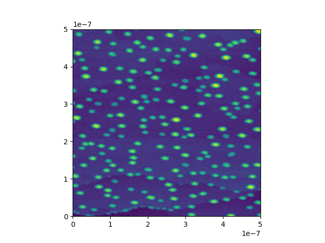
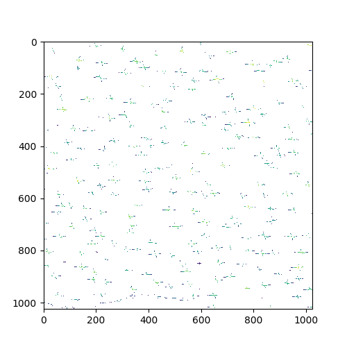
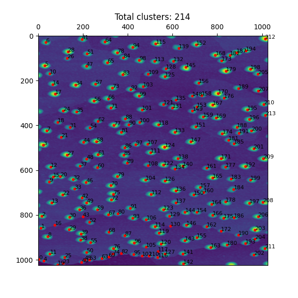
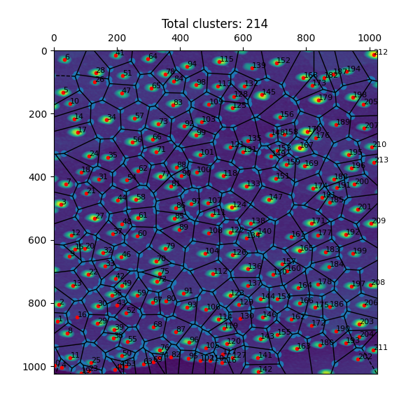
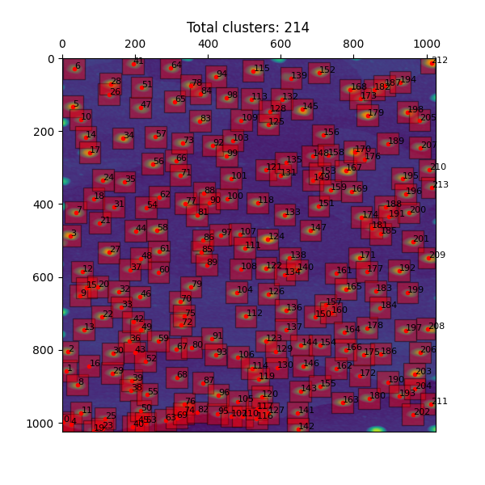

# stm-cluster-heightzer
Stm cluster height resizer (stm-cluster-heightzer) is a class that finds peaks of clusters (high bumps) in a scanning tunneling microscope (STM) image(data)
## Usage
As all the first you need to plainnen the image suitable. I am using  <a href="http://gwyddion.net/">Gwyddion</a>  for this. So the stm-cluster-heightzer has a method for importing gwyydion data:

```
gw_file = 'my_folder/my_data.gwy'
all_channels = load_from_gwyddion(gw_file)
```
Than you get a list like:

```
[Name: 45-1 Z TraceUp ,
 Name: 45-1 Z RetraceUp ,
 Name: 45-1 Z TraceDown ,
 Name: 45-1 Z RetraceDown ,
 Name: Detail 4,
 Name: Detail 5]
```
Choose you data e.g.:

```
my_pic = all_channels[0]
```
You can show the data by :

```
my_pic.show_data()
```



Now you need to find the peaks in peacture

```
my_pic.find_peaks_in_rows()
```



Now use 
```
my_pic.group_clusters()
```
to group thos points to separated clusters

At this stage you can manual add or delet cluster by clickin on it with the mouse. The cluster_peaker will choos the highest point in the near of your click point

```
ax, picable_artists = my_pic.cluster_peaker()
```


If you add or deletet some clusters do not forget to update by 

```
my_pic.update_peaked_clusters(picable_artists)
```
Now you can either cut image with <a href="https://en.wikipedia.org/wiki/Voronoi_diagram"> voronoi algorithm</a> 

``` 
my_pic.cut_image_regions()
ax, picable_artists = my_pic.cluster_peaker(show_regions= True)
```


Or define some window with pixels as a side of rectangular frame

```
my_pic.cut_image_regions(window=30)
ax, picable_artists = my_pic.cluster_peaker(show_regions= True, alpha = 0.4)
```


After that the correction of the heights of every cluster can beginn parralel_correct_height() method compute and correct the hights by calculating the slopes in evry point (see https://richdem.readthedocs.io/en/latest/) and decides than what is ground level and what is peak. Hier only this short explanaition the rest can be understud by reading the docstrings or asking me directly.

```
my_pic.parralel_correct_height(seek_for_steps='both',
                                    cutoff_points=4, 
                                    slope_threshold_factor=0.1,
                                     thold_default_factor=0.9)
```
Similar computaion can be done on one cor by using:

```
my_pic.calc_true_height_4_every_region()
```
An finaly you get an PandasDataFrame with all cluster coordinates, heights and corrected heights
```
my_pic.heights
```
