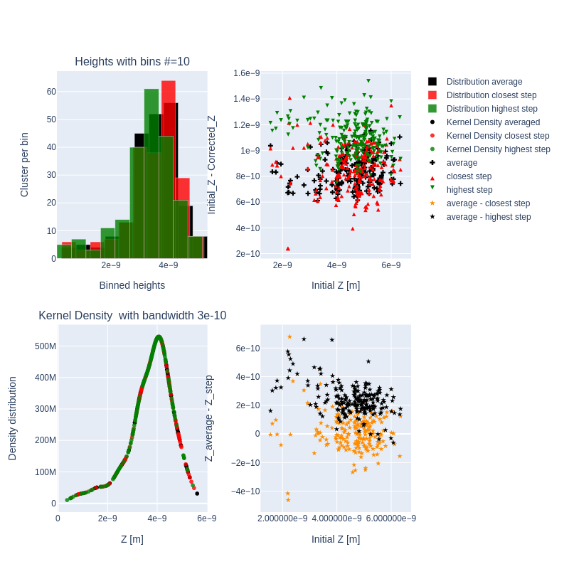

# stm-cluster-heightzer
Stm cluster height resizer (stm-cluster-heightzer) is a class that finds peaks of clusters (high bumps) in a scanning tunneling microscope (STM) image(data)
## Usage
As all the first you need to plainnen the image suitable. I am using  <a href="http://gwyddion.net/">Gwyddion</a>  for this. So the stm-cluster-heightzer has a method for importing gwyydion data:

```
gw_file = 'my_folder/my_data.gwy'
all_channels = load_from_gwyddion(gw_file)
```
Than you get a list like:

```
[Name: 45-1 Z TraceUp ,
 Name: 45-1 Z RetraceUp ,
 Name: 45-1 Z TraceDown ,
 Name: 45-1 Z RetraceDown ,
 Name: Detail 4,
 Name: Detail 5]
```
Choose you data e.g.:

```
my_pic = all_channels[0]
```
You can show the data by :

```
my_pic.show_data()
```


Now you need to find the peaks in peacture

```
my_pic.find_peaks_in_rows()
my_pic.show_peakXYdata()
```


Now use 
```
my_pic.group_clusters()
```
to group thos points to separated clusters

At this stage you can manual add or delet cluster by clickin on it with the mouse. The cluster_peaker will choos the highest point in the near of your click point

```
ax, picable_artists = my_pic.cluster_peaker()
```


If you add or deletet some clusters do not forget to update by 

```
my_pic.update_peaked_clusters(picable_artists)
```
Now you can either cut image with <a href="https://en.wikipedia.org/wiki/Voronoi_diagram"> voronoi algorithm</a> 

``` 
my_pic.cut_image_regions()
ax, picable_artists = my_pic.cluster_peaker(show_regions= True)
```


Or define some window with pixels as a side of rectangular frame

```
my_pic.cut_image_regions(window=30)
ax, picable_artists = my_pic.cluster_peaker(show_regions= True, alpha = 0.4)
```


The Voronoi pattern is more suitable when the clusters are close to each other and it is difficult to separate the clusters with rectangular windows. The Window pattern is probably the most common case and should be used preferably because otherwise the calculation time increases since the larger the windows the more points have to be calculated.


After that the correction of the heights of each cluster can start, parralel_correct_height() method calculates and corrects the heights by calculating the slopes in each point with Filfe con richdem package (see https://richdem.readthedocs.io/en/latest/) and then decides what is ground level and what is peak. Here only this short explanation, the rest you can read in the docstring or ask me directly.


```
my_pic.parralel_correct_height(seek_for_steps='both',
                                    cutoff_points=4, 
                                    slope_threshold_factor=0.1,
                                     thold_default_factor=0.9)
```

The slope_threshold_factor defines how steep is the slope used to determine the ground level. Must be adjusted mostly on the first image and then it is the same for all similar measurements.


If the parameter seek_for_steps = 'both' is set then the script tries to determine the steps in the region in addition to the averaged value of the ground level. It tries to group the points with the parameter thold_default_factor. The larger the factor, the further apart the centers of the grouped points may lie. The adjustment can also be performed on individual regions, this must often be done on the steps. 


cutoff_points: if the number of points in one of the groups is equal to cutoff_points then they are not considered as a group (eleminate artifacts)


An finaly you get an PandasDataFrame with all cluster coordinates, heights and corrected heights.
```
my_pic.heights
```


The x,y coordinates are in pixels and x_m/y_m coordinates are in physical dimensions (in this case meters). The coordinates in pixels are used for simplicity, because so the search for pixels with the eye, in my opinion, is easy.  

By using plot_heights_distribution() you can see some statistics:
```
my_pic.plot_heights_distribution()
```

